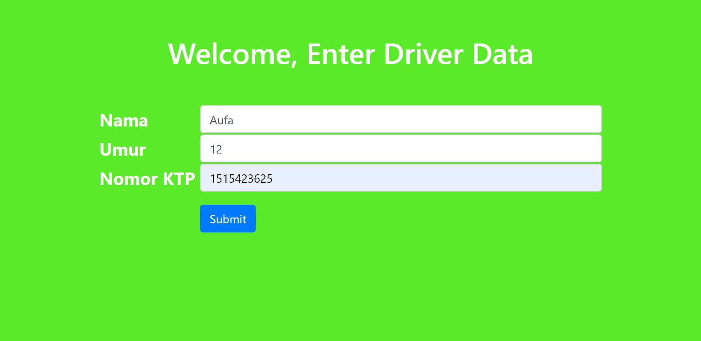

# Deskripsi Singkat Aplikasi
Aplikasi ini merupakan implementasi penggunaan MVC pada Spring Framework. Aplikasi meminta pengguna untuk memasukkan nama, umur, dan ktp untuk kemudian ditampilkan di halaman berikutnya. Route '/' akan merujuk pada main-menu.jsp. Pada halaman utama terdapat button yang akan merujuk pada /formDriver ke HelloWorldController. Di dalam HelloWorldController terdapat /showForm untuk menampilkan formulir dan /showDriver untuk menampilkan hasil input didalam formulir. Setelah pengguna mengisi formulir dan menekan tombol submit, controller akan merujuk pada detailDriver.jsp

## Implementasi MVC
### Model
Aplikasi ini memiliki satu model bernama DriverOjol. 

```java
public class DriverOjol {

	private String namaDriver;
	private int umur;
	private int ktp;
	
}

```

### View
[First Page](https://github.com/aufawibowo/Tugas-2-PBKK/blob/master/WebContent/WEB-INF/view/main-menu.jsp)
[Second page](https://github.com/aufawibowo/Tugas-2-PBKK/blob/master/WebContent/WEB-INF/view/formDriver.jsp)
[Third Page](https://github.com/aufawibowo/Tugas-2-PBKK/blob/master/WebContent/WEB-INF/view/detailDriver.jsp)

### Controller
[First Page](https://github.com/aufawibowo/Tugas-2-PBKK/blob/master/src/com/aufa/springdemo/mvc/HelloWorldController.java)
[Second page](https://github.com/aufawibowo/Tugas-2-PBKK/blob/master/src/com/aufa/springdemo/mvc/HomeController.java)


# Screenshot

url http://localhost:8081/spring-mvc-demo/

http://localhost:8081/spring-mvc-demo/showForm

http://localhost:8081/spring-mvc-demo/showDriver


